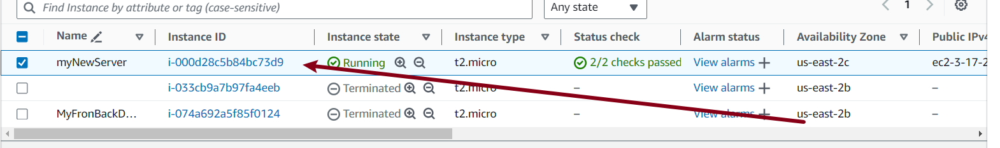
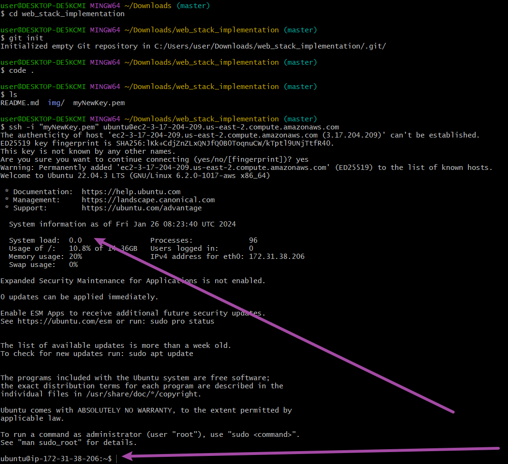
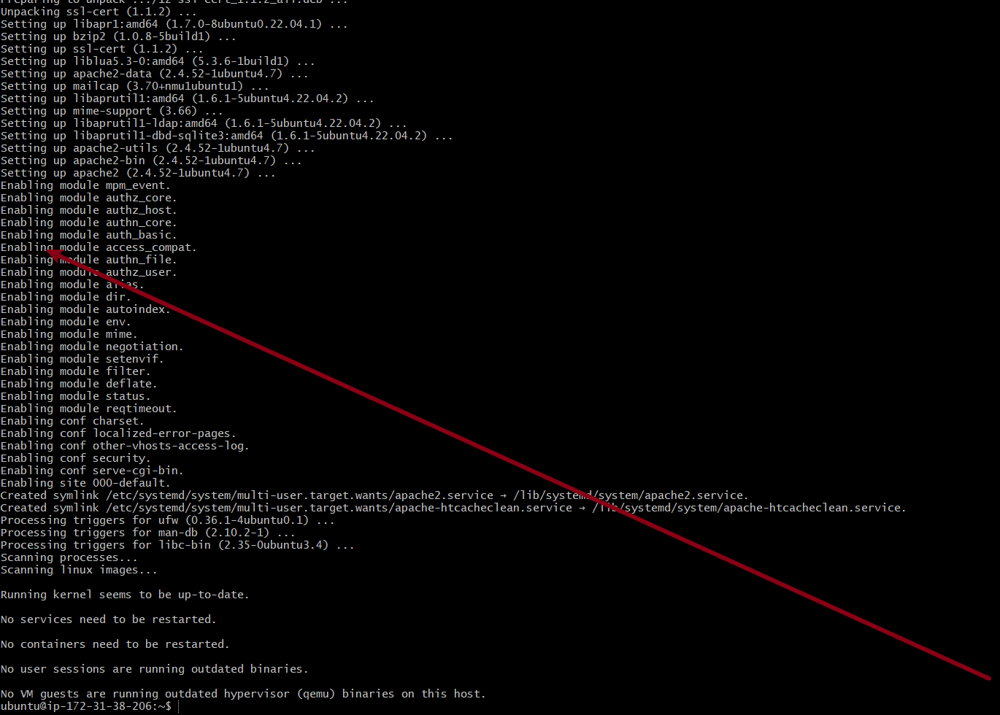
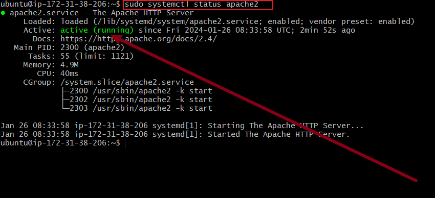
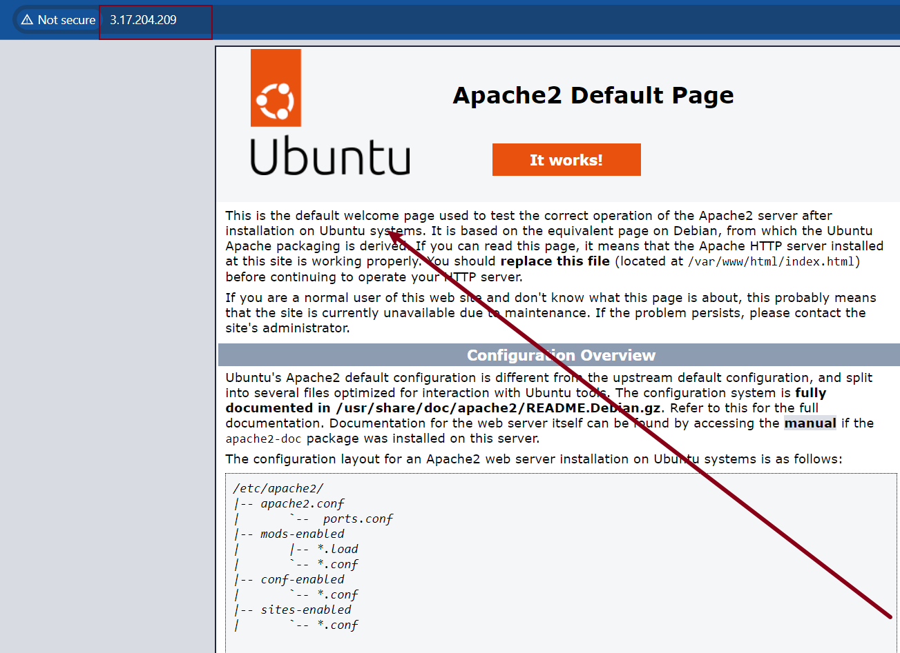
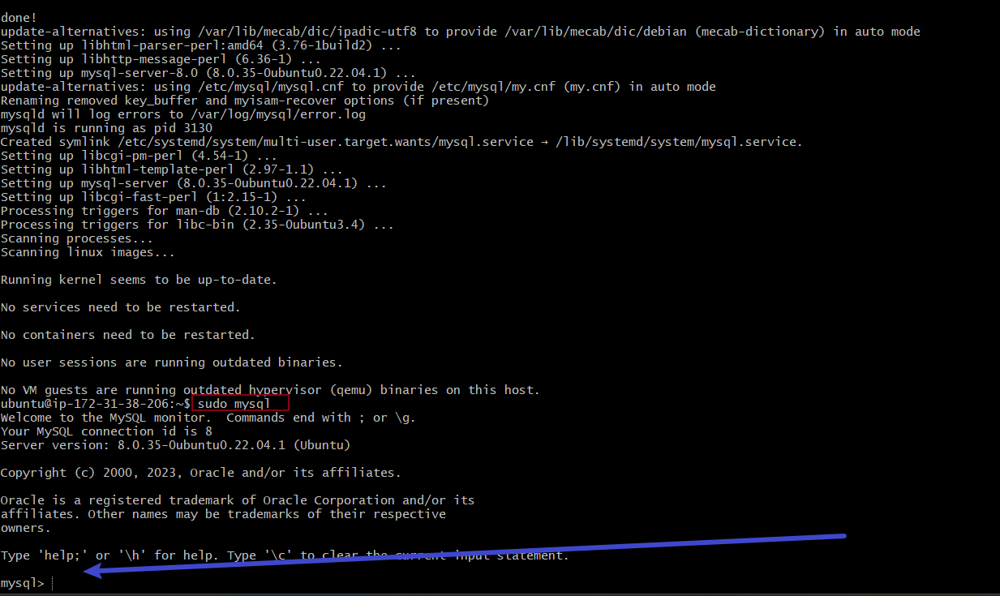
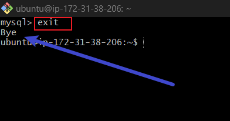
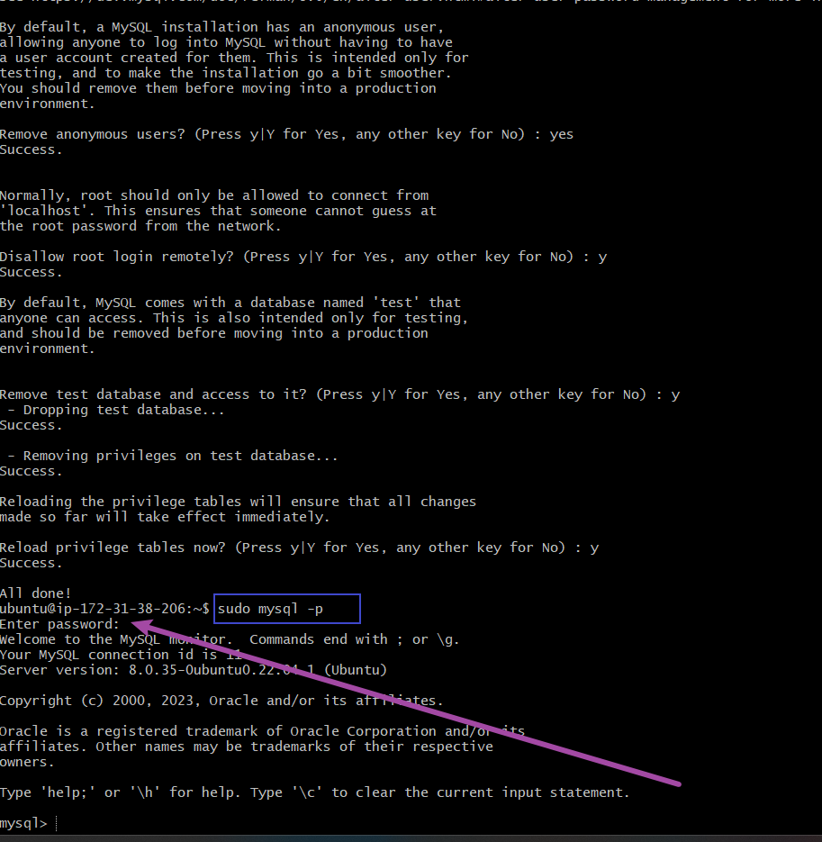
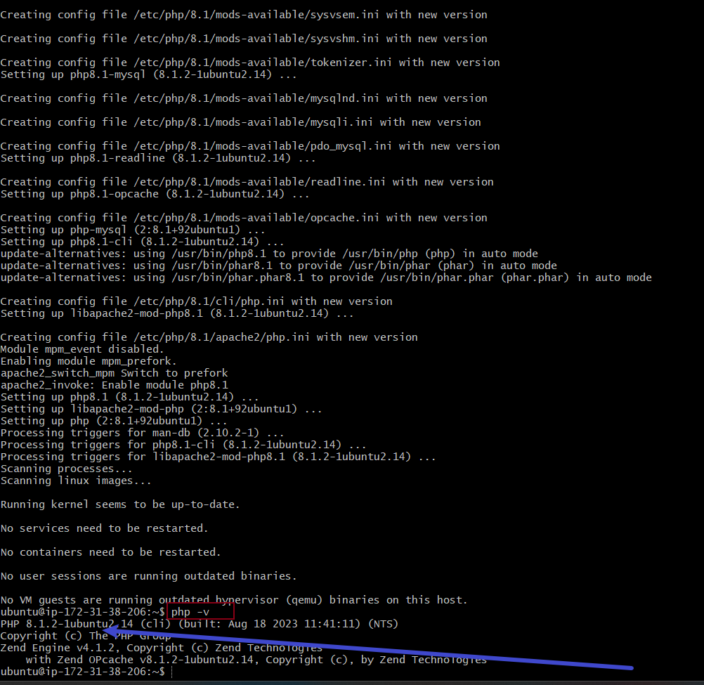
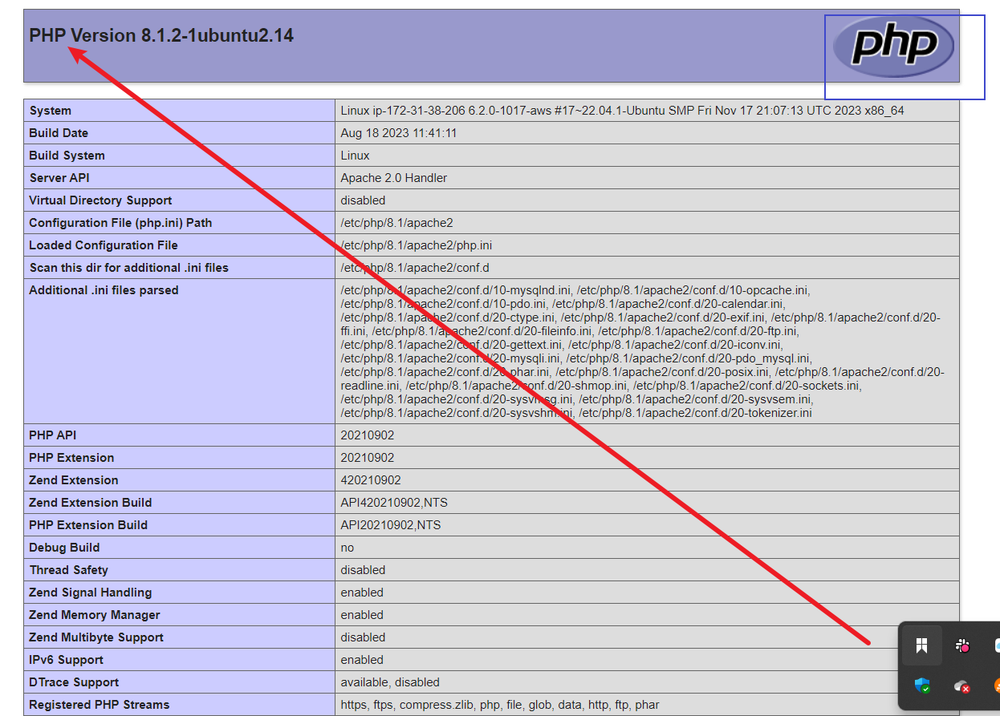

# LAMP stack implementation
This is a comprehensive program designed seeking to build and deploy web application using the LAMP stack. There are different stack of technology that make different solution possible. These stacks of technology are known as web stack. Example of web stack includes LAMP(Linux, Apache, Mysql and PHP), LEMP (Linux, Nginx, Mysql and PHP), MEAN (MongoDB, ExpressJS, ANgularJS NodeJS) and MERN (MongoDB,ExpressJS, ReactJS and NodeJS)

## Creating an instance ec2

Before you can launch and connect to an Amazon EC2 instance, you need to create a key pair, unless you already have one. You can create a key pair using the Amazon EC2 console, and then you can launch your EC2 instance.

## Connecting ec2 to ubuntu

## installing apache2
Apachehttp server is the most widely used web server software. it is an open source software available for free. it is fast, reliable and secure.

## apache2 status

## Apache2 default page

## installing Mysql

MYSQL is a database management system used within PHP environment

## exiting Mysql

## Mysql password setting

## PHP installation

PHP is the component of our set up that will process code to display dynamic content to the end user.

## PHP default page.

